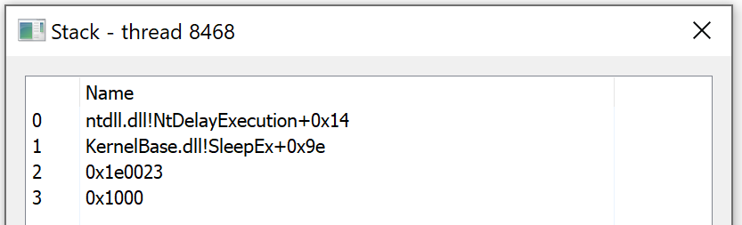
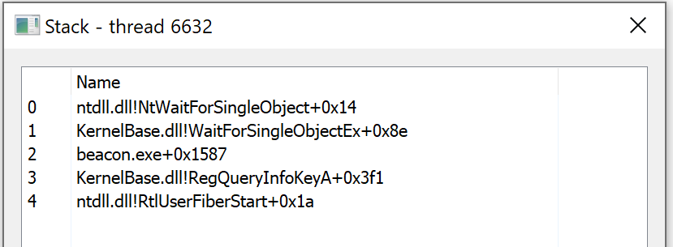
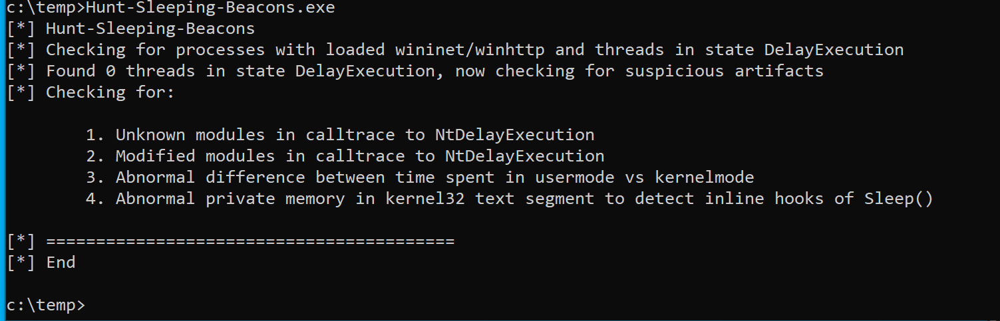

# Thread Stack Spoofing

AV / EDR detections mechanisms have been improving over the years and
one specific technique that is used is thread stack inspection. This
technique determines the legitimacy of a process that is calling a
function or an API.

The stack trace above shows addresses not mapped to any module. This
would determine this as a potential indicator for AV/EDR engines.

Some projects have been published like mgeeky’s
https://github.com/mgeeky/ThreadStackSpoofer, which has been shown to work.

As stated in the ThreadStackSpoofer documentation, the implementation
is effective, but it could be improved as for this case, return address
is invalidated (zeroed) right before Sleeping, and thus stack walking
can not be performed.

One mechanism that allows thread stack switching is Microsoft Fibers
https://docs.microsoft.com/en-us/windows/win32/procthread/fibers.

The Arsenal Kit has been updated to implement stack spoofing using the
Microsoft Fiber functions.  This technique does not invalidate the stack,
and exercises a normal code execution workflow, leveraging the stack
switching side effect of Microsoft Fibers.

Now scan the target using the project Hunt Sleeping Beacons by thefLink
https://github.com/thefLink/Hunt-Sleeping-Beacons

# How to use

In order to enable/disable the stack spoofing technique with the Arsenal Kit,
you should modify the arsenal_kit.config file.

1) set the artifactkit_stack_spoof setting to true (default) or false
2) Build the kits `build_arsenal_kit.sh`
3) Load the script - In Cobalt Strike -> Script Manager -> Load `dist/arsenal_kit.cna`
